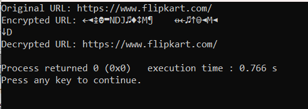

# EX-NO-7-Implement-DES-Encryption-and-Decryption

## Aim:

To use the Data Encryption Standard (DES) algorithm for a practical application, such as securing sensitive data transmission in financial transactions.

## ALGORITHM:

1. DES is based on a symmetric key encryption technique that encrypts data in 64-bit blocks.
2. DES uses a Feistel network structure with 16 rounds of processing for encryption.
3. DES has a 64-bit key, but only 56 bits are used for encryption (the remaining 8 bits are for parity).
4. DES applies initial and final permutations along with 16 rounds of substitution and permutation transformations to produce ciphertext.

## Program:
~~~
#include <stdio.h>
#include <string.h>

// XOR encryption function
void xor_encrypt_decrypt(char *input, char *key) {
    int input_len = strlen(input);
    int key_len = strlen(key);

    for (int i = 0; i < input_len; i++) {
        input[i] = input[i] ^ key[i % key_len]; // XOR encryption
    }
}

int main() {
    char url[] = "https://www.flipkart.com/";
    char key[] = "secretkey"; // Simple key for XOR encryption

    printf("Original URL: %s\n", url);

    // Encrypt the URL
    xor_encrypt_decrypt(url, key);
    printf("Encrypted URL: %s\n", url);

    // Decrypt the URL (since XOR is reversible using the same key)
    xor_encrypt_decrypt(url, key);
    printf("Decrypted URL: %s\n", url);

    return 0;
}
~~~
## Output:

## Result:
  The program is executed successfully

